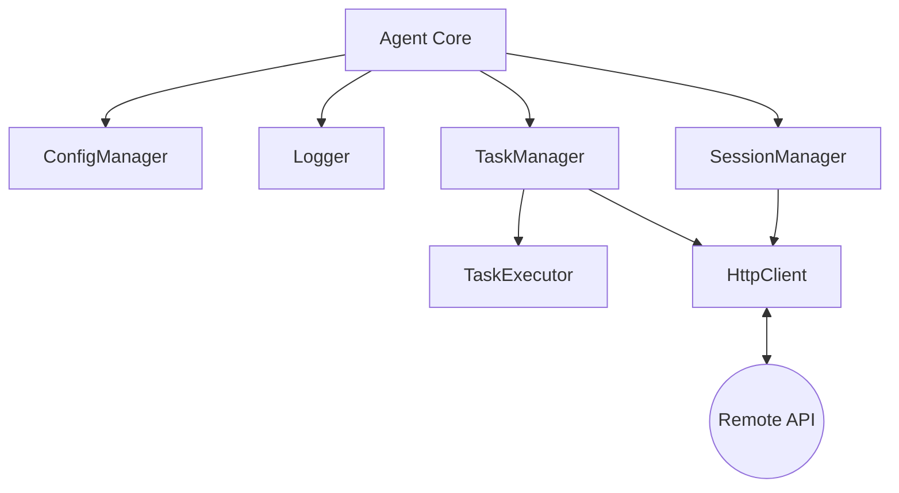

# WEB-AGENT

**WEB-AGENT** — это высокопроизводительное, кроссплатформенное клиентское приложение на языке C++, предназначенное для автоматизированного выполнения удаленных команд и сценариев под управлением централизованного сервера.

[](https://isocpp.org/)
[](LICENSE)
[](#)

---

## Обзор

Проект представляет собой автономного агента, работающего в фоновом режиме. Он обеспечивает надежный канал взаимодействия между локальной машиной и управляющим сервером по протоколу HTTP/HTTPS. Агент предназначен для динамического получения задач, их выполнения и оперативной передачи результатов (включая файлы логов и выходные данные) обратно на сервер.

### Основные сценарии использования
*   **Удаленный мониторинг:** Сбор системных логов и метрик.
*   **Автоматизация задач:** Дистанционный запуск скриптов и программ.
*   **Управление контентом:** Загрузка и воспроизведение медиафайлов по требованию.

---

## Ключевые особенности

*   **Кроссплатформенность:** Полная поддержка Windows, Linux и macOS (используются нативные механизмы исполнения команд).
*   **Автономность:** Интеллектуальный механизм регистрации (Session Management) с сохранением состояния между перезапусками.
*   **Надежность:** Реализация стратегии *Exponential Backoff* для обработки временной недоступности сети или сервера.
*   **Гибкая конфигурация:** Управление через структурированные JSON-файлы.
*   **Минимализм:** Низкое потребление системных ресурсов (ЦП и ОЗУ) благодаря эффективной реализации на C++.

---

## Архитектура

Система построена на модульной архитектуре, обеспечивающей простоту расширения и поддержки:



*   **Agent Core:** Центральный цикл управления (регистрация -> опрос -> выполнение).
*   **SessionManager:** Управление UID и безопасными кодами доступа (Access Code).
*   **TaskExecutor:** Изолированный запуск системных процессов и управление ресурсами.
*   **HttpClient:** Нативная обертка над сетевыми утилитами (curl/wget) для взаимодействия с API.

---

## Быстрый старт

### Требования
*   Компилятор C++ с поддержкой стандарта **C++17** и выше.
*   **CMake** версии 3.10 или старше.
*   Установленные системные утилиты: `curl` (Windows) или `wget`/`curl` (Linux/macOS).

### Сборка
1. Клонируйте репозиторий:
   ```bash
   git clone https://github.com/your-repo/webagent.git
   cd webagent
   ```
2. Создайте директорию для сборки и скомпилируйте проект:
   ```bash
   mkdir build && cd build
   cmake ..
   cmake --build .
   ```

---

## Конфигурация

Настройка агента осуществляется через файл `config/config.json`. 

| Параметр | Описание | Пример |
| :--- | :--- | :--- |
| `uid` | Уникальный идентификатор агента | `"agent_007"` |
| `server_uri` | Базовый URL управляющего сервера | `"https://api.server.com/"` |
| `request_interval` | Частота опроса сервера (в секундах) | `5` |
| `local_control_port` | Локальный API для связи фронта и агента | `8787` |
| `log_file` | Путь к файлу журнала событий | `"./logs/agent.log"` |

Пример файла:
```json
{
  "uid": "bmstu_agent_01",
  "server_uri": "https://xdev.arkcom.ru:9999/app/api/",
  "request_interval": 10,
  "local_control_port": 8787,
  "max_retry_interval": 60
}
```

---

## Использование

После успешной сборки запустите исполняемый файл:

```bash
./webagent
```

По умолчанию агент при старте автоматически открывает фронтенд `frontend/index.html` в браузере.
Если нужно запустить только агент без UI:

```bash
./webagent --no-frontend
```

Фронтенд синхронизирует выбранный видеофайл с агентом через локальный endpoint:

`POST http://127.0.0.1:<local_control_port>/api/selected-video`

### Принципы работы
1.  **Регистрация:** При первом запуске агент регистрируется на сервере и получает `access_code`, который сохраняется локально в скрытом файле.
2.  **Опрос задач:** Агент периодически запрашивает задачи у сервера.
3.  **Исполнение:** 
    *   `TASK`: Выполнение специфических сценариев (например, загрузка и открытие видео).
    *   `FILE`: Сбор и отправка логов выполнения на сервер.
    *   `CONF`: Дистанционное завершение работы или обновление конфигурации.

---
