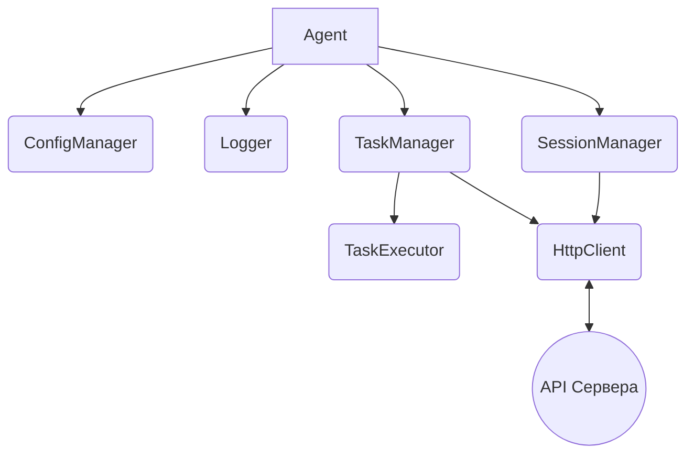
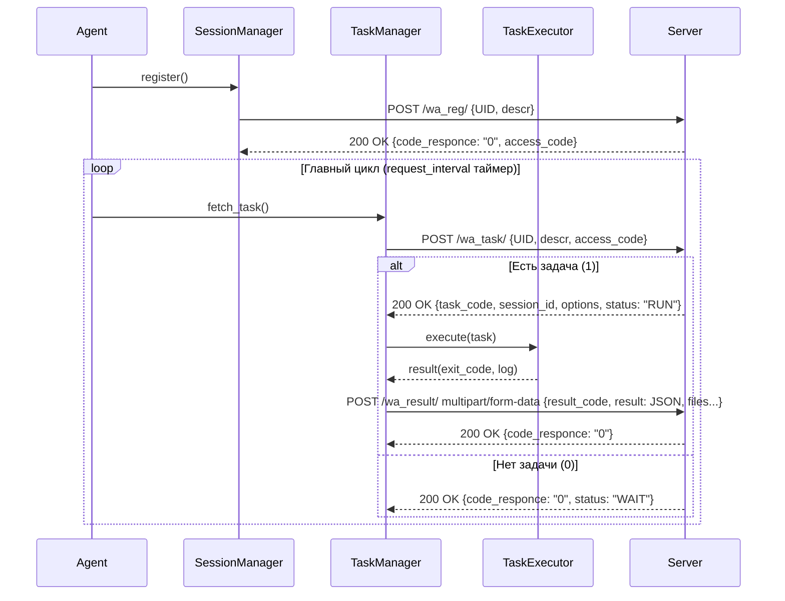

# Архитектура системы WEB-AGENT

## 1. Общая архитектура (UML Диаграмма компонентов)

## 2. Структура классов

### 2.1 Agent (Управляющий класс)
**Ответственность:** Запуск и остановка сервиса, главный цикл приложения (Main Loop). Опрашивает сервер через `TaskManager` по таймеру.
**Поля:** `config_`, `logger_`, `session_`, `task_manager_`, `is_running_`
**Методы:**
* `init()`: Инициализация компонентов.
* `run()`: Главный автономный цикл (регистрация -> ожидание -> запрос -> выполнение -> отправка результата).
* `stop()`: Корректное завершение работы агента.

### 2.2 ConfigManager
**Ответственность:** Чтение и парсинг конфигурационного файла (JSON).
**Поля:** Структура настроек (uid, server_uri, request_interval, max_retry_interval и т.д.)
**Методы:**
* `load(path)`: Загружает конфигурационный JSON файл.
* `get<T>(key)`: Возвращает параметр.

### 2.3 Logger
**Ответственность:** Запись логов в файл и/или консоль вывода.
**Формат логирования:**
`[YYYY-MM-DD HH:MM:SS] [LEVEL] [MODULE] Сообщение`
*Пример:* `[2023-11-20 15:04:05] [INFO] [Agent] Успешно зарегистрирован.`
**Уровни:** `TRACE`, `DEBUG`, `INFO`, `WARN`, `ERROR`, `FATAL`.
**Методы:** `log(level, module, message)`, а также шорткаты `info()`, `error()` и т.д.

### 2.4 SessionManager
**Ответственность:** Управление аутентификацией, хранение состояния сессии (UID, Access Code).
**Поля:** `uid`, `descr`, `access_code`, `is_registered`.
**Методы:**
* `register_agent(http_client)`: Запрос на сервер по ручке `/wa_reg/`. При успехе сохраняет `access_code`.
* `get_access_code()`: Получить текущий Access Code.
* `reset_session()`: Сброс текущей регистрации при ошибке авторизации (например, неверный код).

### 2.5 TaskManager
**Ответственность:** Обрабатывает запрос задач у сервера, управляет очередью (если применимо) и отправкой результата.
**Поля:** `http_client_`, `session_manager_`.
**Методы:**
* `fetch_task()`: Запрос к `/wa_task/`. Разбирает JSON-задачу (`task_code`, `session_id`, `options`).
* `send_result(session_id, result_code, result_json, files)`: Отправляет данные (в формате multipart/form-data) на сервер через `/wa_result/`.

### 2.6 TaskExecutor
**Ответственность:** Изолированный запуск процессов (команд), мониторинг их выполнения, захват stderr/stdout.
**Поля:** Директории `tasks` и `results`.
**Методы:**
* `execute_system_command(command)`: Выполняет системный sh/cmd вызов.
* `execute_program(path, args)`: Запускает бинарник.
* `process_file_transfer(path)`: Готовит файлы к загрузке.

### 2.7 HttpClient
**Ответственность:** Абстракция над HTTP (например, библиотека CPR или libcurl).
**Поля:** Базовый `server_uri`.
**Методы:** `post(endpoint, json_payload)`, `post_multipart(endpoint, multipart_payload)`. Возвращает структуру с HTTP-статусом и телом ответа.

---

## 3. Логика сессий
1. Агент стартует и читает `config.json`.
2. Вызывает `SessionManager::register_agent`. Отправляет свой `UID` и `descr`.
3. Если сервер отвечает `code_responce: "0"` и даёт `access_code`, сессия считается активной.
4. При каждом запросе `/wa_task/` передаются `UID`, `descr` и `access_code`. Каждая задача содержит уникальный временный `session_id`.
5. Если сервер отвечает `code_responce: "-2"` (ошибка, неверный код), `access_code` очищается, и агент переходит к шагу 2.

---

## 4. Механизм retry/backoff (Стратегия повторов)
**Сценарий:** Сервер недоступен (тайм-аут, 5xx ошибка, нет сети).
**Алгоритм (Exponential Backoff):**
* Текущий интервал опроса = `request_interval` (например, 10 сек).
* При ошибке сети:
  * Спать на `Текущий интервал`.
  * Увеличить интервал для следующего раза: `min(Текущий интервал * 2, max_retry_interval)` (где макс = 60 сек).
* При успешном ответе:
  * Вернуть `Текущий интервал` в стандартное значение `request_interval`.

---

## 5. Обработка ошибок
* **Ошибки старта:** Отсутствует `config.json` -> логгирование FATAL и немедленное завершение с exit(1).
* **Ошибки исполнения задач:** Ошибка запуска процесса в `TaskExecutor` -> агент не падает, а проставляет `task_exit_code = -1` (или специфика ОС), формирует лог ошибки и отсылает на сервер как результат выполнения.
* **Ошибка отправки результата:** Агент должен пытаться повторить отправку с учетом Exponential Backoff, пока результат не уйдёт на сервер. Новые задачи в этот момент не запрашиваются.

---

## 6. UML Диаграмма Последовательности (Sequence Diagram)

